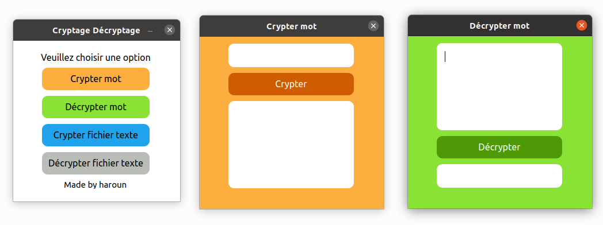

# Crypt_Decrypt

A python program that allows you to encrypt and decrypt a character string or a text file.

The key is changeable by modifying the functions of the python file with the name "background.py" to adapt the program to your needs. 

To encrypt a text file you need to create a text file with the name "decode.txt" where you put your text to be encrypted.

To decrypt a text file you want to create a text file with the name "code.txt" where you put your text to be decrypted.

**Prerequisites:**
- Python 3
- PyQt5

**How to run**
`$ python3 foreground.py`                

Result:

